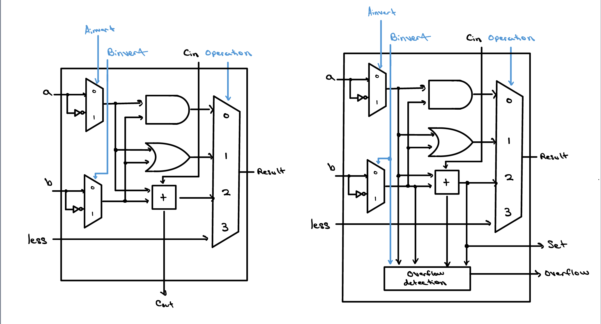
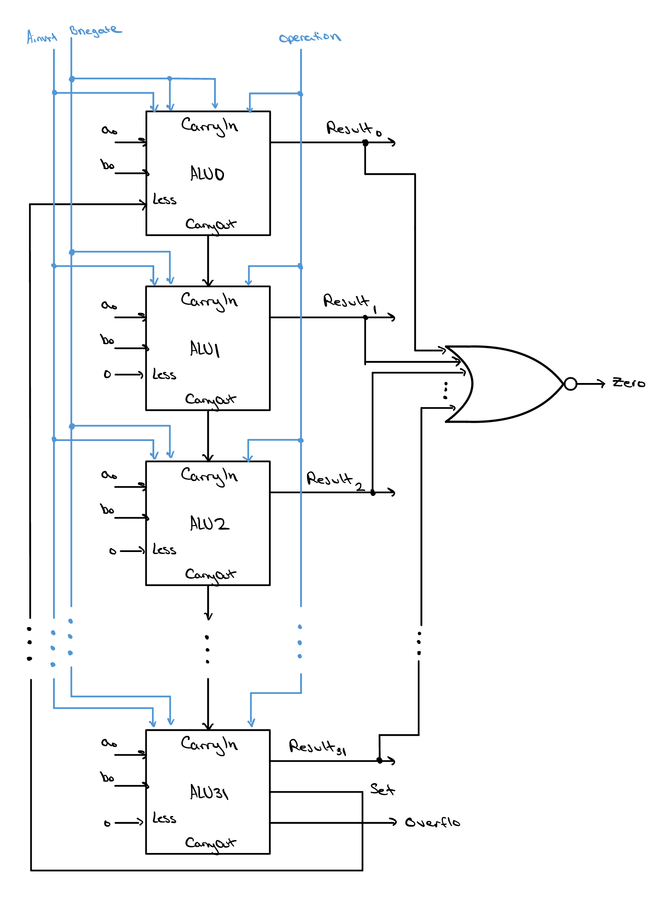

# ALU — RISC-V CPU Design

A parameterized, structural **N-bit Arithmetic Logic Unit** (default `N = 32`) built from
1-bit slices in the classic Patterson & Hennessy style. The least-significant `N-1` bits are
`alu_slice` blocks chained as a ripple-carry adder, terminated by a dedicated `alu_msb` block
that produces the overflow flag and the signed `set-less-than` signal.

**Author:** Elliot Staresinic

---

## Directory Structure

```
alu/
├── rtl/          # Synthesizable Verilog source (design under test)
├── testbench/    # Verilog testbenches and stimulus
├── docs/         # Architecture diagrams and documentation
├── waveforms/    # Saved simulation waveforms (.vcd) and viewer configs
└── README.md     # This file
```

---

## Architecture

The ALU is a ripple-carry chain. Each bit position is computed by a 1-bit `alu_slice`,
except the most-significant bit, which uses an `alu_msb` block to generate the overflow
and `setLess` signals needed for signed comparison.

### Bit slice and MSB block

<!-- TODO: rename to match your actual file in docs/ -->


*Left: `alu_slice` (used for bits 0 … N-2). Right: `alu_msb` (bit N-1).*

### Ripple-carry structure

<!-- TODO: rename to match your actual file in docs/ -->


*The carry-out of each slice feeds the carry-in of the next. The initial carry-in (`cout[0]`)
is driven by `Bnegate`, enabling two's-complement subtraction. The MSB's `setLess` is routed
back to the `less` input of the least-significant slice for `slt`.*

---

## Module Hierarchy

```
alu_full
├── alu_slice   (×(N-1))
│   ├── mux_2x1      (A invert)
│   ├── mux_2x1      (B invert)
│   ├── full_adder
│   └── mux_4x1      (operation select)
└── alu_msb
    ├── mux_2x1      (A invert)
    ├── mux_2x1      (B invert)
    ├── full_adder
    └── mux_4x1      (operation select)
```

| Module | File | Description |
|---|---|---|
| `alu_full`  | `rtl/alu_full.v`  | Top level. Instantiates `N-1` slices + one MSB block; produces `result`, `ovf`, `zero`. |
| `alu_slice` | `rtl/alu_slice.v` | 1-bit ALU slice for bits 0 … N-2. |
| `alu_msb`   | `rtl/alu_msb.v`   | MSB slice; adds overflow detection and `setLess` generation. |
| `full_adder`| `rtl/full_adder.v`| 1-bit combinational full adder. |
| `mux_2x1`   | `rtl/mux_2x1.v`   | N-bit 2:1 multiplexer (operand inversion). |
| `mux_4x1`   | `rtl/mux_4x1.v`   | N-bit 4:1 multiplexer (operation select). |

---

## Top-Level Interface (`alu_full`)

| Port | Direction | Width | Description |
|---|---|---|---|
| `a`       | input  | `N`   | Operand A |
| `b`       | input  | `N`   | Operand B |
| `control` | input  | `4`   | Operation control vector (see below) |
| `result`  | output | `N`   | Operation result |
| `ovf`     | output | `1`   | Overflow (signed add/sub) |
| `zero`    | output | `1`   | Asserted when `result == 0` |

Parameter `N` defaults to `32`.

### Control Vector

The 4-bit `control` field decomposes as:

| Bits | Name | Function |
|---|---|---|
| `control[3]`   | `Ainvert`   | Invert operand A |
| `control[2]`   | `Bnegate`   | Invert operand B **and** set carry-in (two's-complement subtract) |
| `control[1:0]` | `operation` | Result mux select: `00`=AND, `01`=OR, `10`=ADD, `11`=less |

### Operations Driven by the Control Unit

The control unit issues seven operations: **AND, OR, ADD, SUB, SLT, NOR, NAND**.
Their codes are the rows marked ✓ in the full decode table below.

### Full Control Decode

All 16 `control` values are listed for completeness. The ✓ rows are the operations the
control unit actually drives; the remaining rows are byproducts that the datapath can still
produce. `aMuxOut = Ainvert ? ~a : a`, `bMuxOut = Bnegate ? ~b : b`, and the adder carry-in
equals `Bnegate`.

| `control[3:0]` | Ainvert | Bnegate | operation | Result | Operation | Driven |
|---|---|---|---|---|---|---|
| `0000` | 0 | 0 | `00` AND | `a & b`            | AND  | ✓ |
| `0001` | 0 | 0 | `01` OR  | `a \| b`           | OR   | ✓ |
| `0010` | 0 | 0 | `10` ADD | `a + b`            | ADD  | ✓ |
| `0011` | 0 | 0 | `11` less| less of `a + b`    | — (no meaningful compare) | |
| `0100` | 0 | 1 | `00` AND | `a & ~b`           | logic byproduct | |
| `0101` | 0 | 1 | `01` OR  | `a \| ~b`          | logic byproduct | |
| `0110` | 0 | 1 | `10` ADD | `a + ~b + 1` = `a - b` | SUB | ✓ |
| `0111` | 0 | 1 | `11` less| signed `a < b`     | SLT  | ✓ |
| `1000` | 1 | 0 | `00` AND | `~a & b`           | logic byproduct | |
| `1001` | 1 | 0 | `01` OR  | `~a \| b`          | logic byproduct | |
| `1010` | 1 | 0 | `10` ADD | `~a + b` = `b - a - 1` | arith byproduct | |
| `1011` | 1 | 0 | `11` less| less of `~a + b`   | — (no meaningful compare) | |
| `1100` | 1 | 1 | `00` AND | `~a & ~b` = `~(a \| b)` | NOR  | ✓ |
| `1101` | 1 | 1 | `01` OR  | `~a \| ~b` = `~(a & b)` | NAND | ✓ |
| `1110` | 1 | 1 | `10` ADD | `~a + ~b + 1` = `-(a + b) - 1` | arith byproduct | |
| `1111` | 1 | 1 | `11` less| less of `~a + ~b + 1` | — (no meaningful compare) | |

**Notes**

- **NOR / NAND** reuse the AND/OR datapath with both operands inverted (De Morgan):
  `~(a | b) = ~a & ~b` and `~(a & b) = ~a | ~b`. The carry-in forced by `Bnegate` is
  harmless here because the adder output is not selected.
- **SLT** is only correct when the adder performs `a - b` (Ainvert=0, Bnegate=1); the MSB
  derives `setLess` from the subtraction's sign and overflow. The other `operation = 11`
  rows compare against a different sum and are not meaningful comparisons.
- **Byproduct rows** are reachable in hardware but are not part of the defined instruction set.

### Status Flags

- **`zero`** — `~|result`; asserted when every result bit is 0 (e.g. `a == b` after a `SUB`).
- **`ovf`** — `cin ^ msbCout` in the MSB block; signed overflow for add/subtract.

---

## Simulation (Icarus Verilog)

Compile the design and a testbench, then run and view the waveform:

```bash
# Compile (adjust the testbench name as needed)
iverilog -o alu_sim rtl/*.v testbench/alu_full_tb.v

# Run
vvp alu_sim

# View the dumped waveform
gtkwave waveforms/alu_full_tb.vcd
```

Ensure your testbench includes `$dumpfile("waveforms/alu_full_tb.vcd");` and `$dumpvars;`
so the waveform lands in the `waveforms/` directory.

---

## Notes

- The design is fully combinational and structural — no clock, no synthesis-specific primitives.
- `N` is parameterizable; the slice/MSB split scales automatically via the generate loop in `alu_full`.
