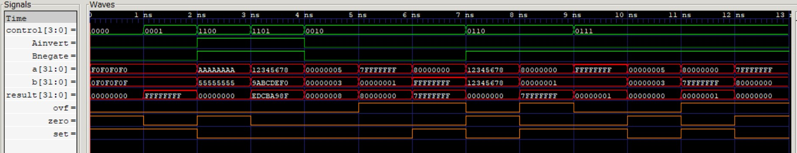

# Arithmetic Logic Unit

A parameterized, structural **N-bit Arithmetic Logic Unit** (ALU) built from 1-bit slices in the classic Patterson & Hennessy style. The least-significant `N-1` bits are `alu_slice` blocks chained as a ripple-carry adder, terminated by a dedicated `alu_msb` block that produces the overflow flag and the signed set-less-than signal. The design is fully combinational and verified by a self-checking testbench that applies directed edge-case vectors and validates `result`, `ovf`, and `zero` against an independent behavioral model.

---

## Architecture

The ALU is a ripple-carry chain with no clock and no synthesis-specific primitives. Each bit position is computed by an identical 1-bit `alu_slice`, except the most-significant bit, which uses an `alu_msb` block to generate the overflow and `setLess` signals required for signed comparison. The carry-out of each slice feeds the carry-in of the next; the initial carry-in is driven by `Bnegate`, enabling two's-complement subtraction.

### Bit Slice and MSB Block


*Left: `alu_slice` (used for bits 0 … N-2). Right: `alu_msb` (bit N-1).*

### Ripple-Carry Structure


*The MSB's `setLess` is routed back to the `less` input of the least-significant slice so that `slt` produces a 1 in bit 0 and 0 elsewhere.*

### Supported Operations

The control unit drives seven operations. Full decode of all 16 control values appears in the [Control Decode](#full-control-decode) section.

| Operation | `control[3:0]` | Function |
|---|---|---|
| AND  | `0000` | `a & b` |
| OR   | `0001` | `a \| b` |
| ADD  | `0010` | `a + b` |
| SUB  | `0110` | `a - b` |
| SLT  | `0111` | signed `a < b` (1 or 0) |
| NOR  | `1100` | `~(a \| b)` |
| NAND | `1101` | `~(a & b)` |

---

## Module Hierarchy

```
alu_full
├── alu_slice   (×(N-1))
│   ├── mux_2x1      (A invert)
│   ├── mux_2x1      (B invert)
│   ├── full_adder
│   └── mux_4x1      (operation select)
└── alu_msb
    ├── mux_2x1      (A invert)
    ├── mux_2x1      (B invert)
    ├── full_adder
    └── mux_4x1      (operation select)
```

| Module | File | Description |
|---|---|---|
| `alu_full`  | `rtl/alu_full.v`  | Top level. Instantiates `N-1` slices + one MSB block; produces `result`, `ovf`, `zero`. |
| `alu_slice` | `rtl/alu_slice.v` | 1-bit ALU slice for bits 0 … N-2. |
| `alu_msb`   | `rtl/alu_msb.v`   | MSB slice; adds overflow detection and `setLess` generation. |
| `full_adder`| `rtl/full_adder.v`| 1-bit combinational full adder. |
| `mux_2x1`   | `rtl/mux_2x1.v`   | N-bit 2:1 multiplexer (operand inversion). |
| `mux_4x1`   | `rtl/mux_4x1.v`   | N-bit 4:1 multiplexer (operation select). |

### Key Design Decisions

**ALU built from 1-bit slices.** `alu_full` instantiates `N-1` identical `alu_slice` modules and one `alu_msb` module via a `generate` loop, so the design scales to any width through the `N` parameter without source changes.

**Subtraction by operand inversion.** `Bnegate` both inverts operand B (through its 2x1 mux) and drives the chain's initial carry-in to 1, forming `a + ~b + 1 = a - b` without a separate subtractor.

**Logic operations via De Morgan.** NOR and NAND reuse the AND/OR datapath with both operands inverted: `~(a | b) = ~a & ~b` and `~(a & b) = ~a | ~b`. The carry-in forced by `Bnegate` is harmless because the adder output is not selected for these operations.

**Signed set-less-than.** The MSB computes `setLess = sum[MSB] ^ ovf`, correcting the sign of `a - b` for overflow, and feeds it back to bit 0. This yields a correct signed comparison even at the extremes (e.g. min-negative vs. max-positive).

**Overflow detection.** The MSB derives `ovf = cin ^ msbCout`, the standard two's-complement signed-overflow condition for the final adder stage.

---

## File Structure

```
alu/
├── Makefile
├── README.md
├── rtl/
│   ├── alu_full.v          32-bit parameterized ALU (top level)
│   ├── alu_msb.v           MSB ALU slice (overflow, setLess)
│   ├── alu_slice.v         1-bit ALU slice
│   ├── full_adder.v        1-bit full adder
│   ├── mux_2x1.v           2x1 multiplexer
│   └── mux_4x1.v           4x1 multiplexer
├── testbench/
│   └── tb_alu_full.v       Self-checking unit testbench
├── waveforms/
│   ├── dump.vcd            Simulation waveform dump
│   └── waveform.jpg        Simulation waveform screenshot
└── docs/
    ├── slice-architecture.jpg   alu_slice (left) and alu_msb (right)
    └── architecture.jpg         Abstracted ripple-carry structure
```

---

## Top-Level Interface (`alu_full`)

| Port | Direction | Width | Description |
|---|---|---|---|
| `a`       | input  | `N`   | Operand A |
| `b`       | input  | `N`   | Operand B |
| `control` | input  | `4`   | Operation control vector (see below) |
| `result`  | output | `N`   | Operation result |
| `ovf`     | output | `1`   | Overflow (signed add/sub) |
| `zero`    | output | `1`   | Asserted when `result == 0` |

Parameter `N` defaults to `32`.

### Control Vector

| Bits | Name | Function |
|---|---|---|
| `control[3]`   | `Ainvert`   | Invert operand A |
| `control[2]`   | `Bnegate`   | Invert operand B **and** set carry-in (two's-complement subtract) |
| `control[1:0]` | `operation` | Result mux select: `00`=AND, `01`=OR, `10`=ADD, `11`=less |

### Full Control Decode

All 16 `control` values are listed for completeness. The ✓ rows are the operations the control unit actually drives; the remaining rows are byproducts that the datapath can still produce. `aMuxOut = Ainvert ? ~a : a`, `bMuxOut = Bnegate ? ~b : b`, and the adder carry-in equals `Bnegate`.

| `control[3:0]` | Ainvert | Bnegate | operation | Result | Operation | Driven |
|---|---|---|---|---|---|---|
| `0000` | 0 | 0 | `00` AND | `a & b`            | AND  | ✓ |
| `0001` | 0 | 0 | `01` OR  | `a \| b`           | OR   | ✓ |
| `0010` | 0 | 0 | `10` ADD | `a + b`            | ADD  | ✓ |
| `0011` | 0 | 0 | `11` less| less of `a + b`    | — (no meaningful compare) | |
| `0100` | 0 | 1 | `00` AND | `a & ~b`           | logic byproduct | |
| `0101` | 0 | 1 | `01` OR  | `a \| ~b`          | logic byproduct | |
| `0110` | 0 | 1 | `10` ADD | `a + ~b + 1` = `a - b` | SUB | ✓ |
| `0111` | 0 | 1 | `11` less| signed `a < b`     | SLT  | ✓ |
| `1000` | 1 | 0 | `00` AND | `~a & b`           | logic byproduct | |
| `1001` | 1 | 0 | `01` OR  | `~a \| b`          | logic byproduct | |
| `1010` | 1 | 0 | `10` ADD | `~a + b` = `b - a - 1` | arith byproduct | |
| `1011` | 1 | 0 | `11` less| less of `~a + b`   | — (no meaningful compare) | |
| `1100` | 1 | 1 | `00` AND | `~a & ~b` = `~(a \| b)` | NOR  | ✓ |
| `1101` | 1 | 1 | `01` OR  | `~a \| ~b` = `~(a & b)` | NAND | ✓ |
| `1110` | 1 | 1 | `10` ADD | `~a + ~b + 1` = `-(a + b) - 1` | arith byproduct | |
| `1111` | 1 | 1 | `11` less| less of `~a + ~b + 1` | — (no meaningful compare) | |

### Status Flags

- **`zero`** — `~|result`; asserted when every result bit is 0 (e.g. `a == b` after a `SUB`).
- **`ovf`** — `cin ^ msbCout` in the MSB block; signed overflow for add/subtract.

---

## Verification

The ALU is combinational, so the testbench is a stand-alone unit test rather than a clocked lockstep model. For every stimulus a behavioral golden model re-derives the expected outputs **without** copying the DUT's gate-level structure:

- `result` is computed from native Verilog operators (`&`, `|`, `+`, `-`, signed `<`, `~`);
- `ovf` is computed from the sign-bit overflow identity `(opA[N-1] == opB[N-1]) && (sum[N-1] != opA[N-1])`, an independent path to the DUT's `cin ^ msbCout`;
- `zero` is computed as `result == 0`.

Every applied vector is compared with 4-state equality (`!==`) so X/Z on the outputs is also caught. A curated set of 13 directed vectors targets the edge cases: logic bit-patterns through all four logic ops (including the `zero` flag), ADD with no overflow and both overflow directions, SUB of equal operands and SUB overflow, and signed SLT (true, false, and the min-negative / max-positive overflow-correction cases). Errors are reported the moment they occur and tallied; a final banner prints PASS/FAIL.

### Running the Simulation

**Option 1 — Makefile (recommended)**

From the `alu/` root:

```bash
make        # compile only
make run    # compile and run
```

> Requires `make` to be installed. On Windows: `winget install GnuWin32.Make`

**Option 2 — Manual compile**

```bash
# Linux / Mac
iverilog -g2012 -o sim \
  testbench/tb_alu_full.v \
  rtl/alu_full.v \
  rtl/alu_msb.v \
  rtl/alu_slice.v \
  rtl/full_adder.v \
  rtl/mux_2x1.v \
  rtl/mux_4x1.v

# Windows (PowerShell) — single line
iverilog -g2012 -o sim testbench/tb_alu_full.v rtl/alu_full.v rtl/alu_msb.v rtl/alu_slice.v rtl/full_adder.v rtl/mux_2x1.v rtl/mux_4x1.v

# Run
vvp sim
```

**View waveforms**

```bash
gtkwave waveforms/dump.vcd
```

A passing run produces:

```
==================================================
 Total vectors applied: 13
 RESULT: PASS - 0 errors. DUT == behavioral oracle.
==================================================
```

### Waveform



---

## Tools

| Tool | Purpose |
|------|---------|
| Icarus Verilog 12.0 | RTL simulation |
| GTKWave / EPWave | Waveform inspection |
| GNU Make | Build automation |

---

*Part of the [RISC-V CPU Design](../README.md) repository.*
