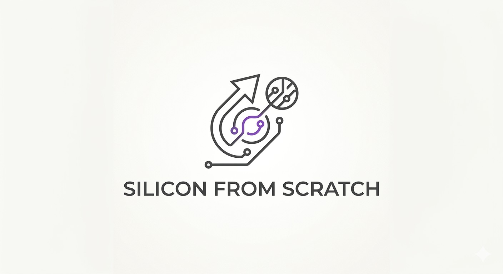

# Silicon From Scratch

A centralized collection of RISC-V processor designs and fundamental building blocks of digital design built from the ground up, documenting my summer of CPU architecture and VLSI design exploration. This repository brings together every stage of the hardware design flow — from register-transfer level (RTL) description, verification, and extending toward physical implementation. You don't learn to ride a bike by reading about it; you strap on your helmet and push off, finding your balance as you go, with hope that your leap into the unknown will take you to somewhere you couldn't have reached standing still.

 

## Contents

| Component | Status | Description |
|-----------|--------|-------------|
| [Single-Cycle CPU](./single-cycle-cpu/) | Complete | RV32I single-cycle Harvard architecture, verified against a lockstep golden model and hand-derived final-state oracle |
| [ALU](./ALU/) | Complete | Parameterized N-bit ripple-carry ALU (slice + MSB), supporting AND, OR, ADD, SUB, SLT, NOR, and NAND; verified against a behavioral oracle |
| Pipelined CPU | Planned | 5-stage pipeline with hazard detection and forwarding |

## What's Inside

Each subdirectory contains either a self-contained CPU design implementing the RV32I instruction set (or a working subset), or a key building block to understanding digital design. Designs will progress in complexity and microarchitectural sophistication. For every design you'll find:

- **RTL** — synthesizable Verilog/SystemVerilog source for the datapath, control unit, register file, ALU, and memory subsystem.
- **Testbenches** — self-checking verification environments, including lockstep golden-model comparison against independent reference simulators and hand-derived final-state oracles.
- **Waveforms** — VCD dumps and simulation traces capturing cycle-by-cycle architectural behavior.
- **Programs** — RISC-V machine-code test programs exercising arithmetic, logic, memory, and control-flow instructions.

## Roadmap

This repository is actively growing. Planned additions include:

- **Physical design** — schematic capture, layout, and full-custom flows using the Cadence toolchain (Virtuoso, Spectre).
- **Transistor-level simulation** — verifying timing and functional behavior beyond the RTL abstraction.
- **Synthesis and timing analysis** — mapping RTL to gates and characterizing performance.

## Tools

Icarus Verilog for RTL simulation, GTKWave/EPWave for waveform inspection, and the Cadence suite for analog/mixed-signal and physical design.

## About

I built these projects to deepen my understanding of computer architecture and the complete digital design flow — from a line of Verilog to a physical layout. This repository serves as a portfolio of that work, intended to be easy for recruiters and collaborators to navigate.
