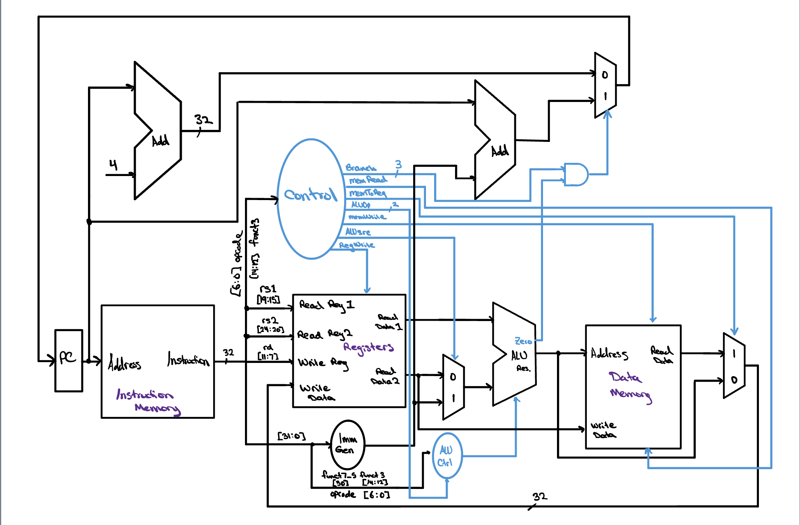

# Single-Cycle RISC-V CPU

A fully functional, single-cycle RV32I processor implemented in Verilog. Every stage of the classical datapath — fetch, decode, execute, memory, and write-back — completes within a single clock cycle. The design is verified by a self-checking testbench that runs a 30-instruction program and independently validates the result against a hand-derived oracle.

## Architecture

The processor follows a **Harvard architecture** with separate instruction and data memories. Control logic is purely combinational — no finite state machine is required in a single-cycle design. The datapath and control unit are connected through a dedicated ALU control unit that decodes `funct3` and `funct7` fields to generate the final 4-bit ALU operation signal.

### System Architecture Diagram



### Supported Instructions

| Format | Instructions |
|--------|-------------|
| R-type | `add`, `sub`, `and`, `or`, `slt` |
| I-type | `addi`, `andi`, `ori`, `lw` |
| S-type | `sw` |
| SB-type | `beq`, `bne`, `blt` |

---

## Module Hierarchy

```
sc_cpu_top_level
├── sc_cpu_control          Main control unit (combinational, opcode-decoded)
├── alu_control             ALU control unit (funct3/funct7 decode)
└── sc_cpu_datapath
    ├── instruct_mem        Read-only instruction memory (loaded from program.mem)
    ├── imm_gen             Immediate generator (I, S, SB, U, UJ formats)
    ├── reg_file            32x32-bit register file (2 read ports, 1 write port)
    ├── mux_2x1             ALU source mux; write-back mux; branch/increment mux (×3)
    ├── alu_full            32-bit ALU (ripple-carry, parameterized)
    │   ├── alu_slice       1-bit ALU slice (bits [30:0])
    │   │   ├── mux_2x1     Output select (ALU result vs. pass-through)
    │   │   ├── mux_4x1     Operation select (add/sub, and, or, slt)
    │   │   └── full_adder  1-bit full adder
    │   └── alu_msb         MSB ALU slice (overflow detection, setLess)
    │       ├── mux_2x1     Output select (ALU result vs. pass-through)
    │       ├── mux_4x1     Operation select (add/sub, and, or, slt)
    │       └── full_adder  1-bit full adder (MSB, feeds overflow logic)
    ├── data_mem            Clocked data memory (word-aligned, read/write enable)
    └── ripple_carry_adder  PC + 4 adder; PC + immediate adder (×2)
```

### Key Design Decisions

**Ripple-carry adder for PC arithmetic.** The PC increment and branch target computation use the same parameterized ripple-carry adder module rather than a behavioral `+` operator, keeping the implementation fully structural at the arithmetic level.

**ALU built from 1-bit slices.** `alu_full` instantiates 31 identical `alu_slice` modules and one `alu_msb` module via `generate`. Each slice supports AND, OR, addition, and set-less-than (SLT). The MSB slice additionally detects signed overflow and drives the `setLess` signal back to bit 0.

**3-bit one-hot branch encoding.** The control unit outputs `branch[2:0]` as a one-hot signal — `100` for BEQ, `010` for BNE, `001` for BLT — rather than a single branch enable. The datapath combines this with the ALU `zero` and `lessThan` flags to select the correct next PC in a single combinational expression.

**x0 hardwired to zero.** Both the register file and the golden reference model enforce that reads from register x0 always return zero and writes to x0 are silently discarded, consistent with the RISC-V specification.

---

## File Structure

```
single_cycle_cpu/
├── README.md
├── rtl/
│   ├── sc_cpu_top_level.v      Top-level module (control + datapath + ALU CU)
│   ├── sc_cpu_datapath.v       Full datapath
│   ├── sc_cpu_control.v        Main control unit
│   ├── alu_control.v           ALU control unit
│   ├── alu_full.v              32-bit parameterized ALU
│   ├── alu_msb.v               MSB ALU slice (overflow, setLess)
│   ├── alu_slice.v             1-bit ALU slice
│   ├── full_adder.v            1-bit full adder
│   ├── ripple_carry_adder.v    N-bit ripple carry adder
│   ├── reg_file.v              32x32-bit register file
│   ├── imm_gen.v               Immediate generator
│   ├── instruct_mem.v          Read-only instruction memory
│   ├── data_mem.v              Clocked data memory
│   ├── mux_2x1.v               2x1 multiplexer
│   └── mux_4x1.v               4x1 multiplexer
├── testbench/
│   └── tb_sc_cpu_top_level.v    Self-checking lockstep testbench
├── programs/
│   └── program.mem             30-instruction RV32I test program (hex)
├── waveforms/
│   └── dump.vcd                Simulation waveform dump
└── docs/
    └── architecture.jpg        Hand-drawn system architecture diagram
```

---

## Test Program

The 30-instruction test program exercises the full supported instruction set including arithmetic, logic, memory access, and all three branch types. Execution traces through multiple conditional branches, producing a non-trivial control flow path.

```
00100093    addi  x1,  x0,  1
00500113    addi  x2,  x0,  5
002081B3    add   x3,  x1,  x2
40118233    sub   x4,  x3,  x1
FFE20293    addi  x5,  x4,  -2
0042E333    or    x6,  x5,  x4
005273B3    and   x7,  x4,  x5
00522433    slt   x8,  x4,  x5
0042A4B3    slt   x9,  x5,  x4
00302223    sw    x3,  4(x0)
00800513    addi  x10, x0,  8
00652223    sw    x6,  4(x10)
407105B3    sub   x11, x2,  x7
FFC52603    lw    x12, -4(x10)
00410663    beq   x2,  x4,  12
003002B3    add   x5,  x0,  x3
00F17693    andi  x13, x2,  15
00A02823    sw    x10, 16(x0)
00F17713    andi  x14, x2,  15
00411A63    bne   x2,  x4,  20
00311463    bne   x2,  x3,  8
407105B3    sub   x11, x2,  x7
00610233    add   x4,  x2,  x6
FE1048E3    blt   x0,  x1,  -16
00326793    ori   x15, x4,  3
00208663    beq   x1,  x2,  12
00114463    blt   x2,  x1,  8
00902A23    sw    x9,  20(x0)
00928013    addi  x0,  x5,  9
40238833    sub   x16, x7,  x2
```

### Expected Final State

| Register | Value | Notes |
|----------|-------|-------|
| x1  | `0x00000001` | |
| x2  | `0x00000005` | |
| x3  | `0x00000006` | |
| x4  | `0x0000000C` | Overwritten by `add x4, x2, x6` |
| x5  | `0x00000003` | |
| x6  | `0x00000007` | |
| x7  | `0x00000001` | |
| x9  | `0x00000001` | |
| x10 | `0x00000008` | |
| x11 | `0x00000004` | |
| x12 | `0x00000006` | |
| x14 | `0x00000005` | |
| x15 | `0x0000000F` | |
| x16 | `0xFFFFFFFC` | Signed -4 |

| Memory Word | Byte Address | Value |
|-------------|-------------|-------|
| dmem[1] | 4  | `0x00000006` |
| dmem[3] | 12 | `0x00000007` |
| dmem[4] | 16 | `0x00000008` |
| dmem[5] | 20 | `0x00000001` |

---

## Verification

The testbench uses two independent verification strategies running simultaneously:

**Lockstep golden model.** A behavioral RV32I simulator executes one instruction ahead of each DUT clock edge. After every committed instruction the complete register file, data memory, and program counter are compared against the DUT via hierarchical references. Any mismatch is reported immediately with the step number, signal name, DUT value, and reference value.

**Final-state oracle.** An independently hand-derived table of expected end-of-program register and memory contents is checked once at completion. This catches any latent bug in the golden model itself — two independent methods must agree on the same answer.

The testbench also produces a per-instruction execution trace:

```
 [ 1]  PC=0x00000000  instr=0x00100093  | addi x1, x0, 1      | x1 <= 0x00000001 (1)
 [ 2]  PC=0x00000004  instr=0x00500113  | addi x2, x0, 5      | x2 <= 0x00000005 (5)
 ...
```

### Running the Simulation

```bash
# Compile (from the single-cycle-cpu/ root)

# Linux / Mac
iverilog -g2012 -o sim \
  testbench/tb_sc_cpu_top_level.v \
  rtl/sc_cpu_top_level.v \
  rtl/sc_cpu_datapath.v \
  rtl/sc_cpu_control.v \
  rtl/alu_control.v \
  rtl/alu_full.v \
  rtl/alu_msb.v \
  rtl/alu_slice.v \
  rtl/full_adder.v \
  rtl/ripple_carry_adder.v \
  rtl/reg_file.v \
  rtl/imm_gen.v \
  rtl/instruct_mem.v \
  rtl/data_mem.v \
  rtl/mux_2x1.v \
  rtl/mux_4x1.v

# Windows (PowerShell) — single line
iverilog -g2012 -o sim testbench/tb_sc_cpu_top_level.v rtl/sc_cpu_top_level.v rtl/sc_cpu_datapath.v rtl/sc_cpu_control.v rtl/alu_control.v rtl/alu_full.v rtl/alu_msb.v rtl/alu_slice.v rtl/full_adder.v rtl/ripple_carry_adder.v rtl/reg_file.v rtl/imm_gen.v rtl/instruct_mem.v rtl/data_mem.v rtl/mux_2x1.v rtl/mux_4x1.v

# Run
vvp sim

# View waveforms (GTKWave)
gtkwave dump.vcd
```

A passing run produces:

```
==================================================
 RESULT: PASS - 0 errors. DUT == reference == oracle.
==================================================
```

---

## Tools

| Tool | Purpose |
|------|---------|
| Icarus Verilog 12.0 | RTL simulation |
| GTKWave / EPWave | Waveform inspection |

---

*Part of the [RISC-V CPU Design](../README.md) repository.*
